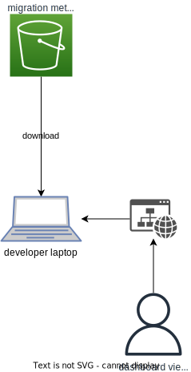

# Practice Migration dashboard

A dashboard to show metrics from practice migrations.

The website is developed using the [Gatsby](https://www.gatsbyjs.com/) framework.

## Metrics calculator lambdas

The data for the dashboard is generated by an AWS lambda, using data exported from Splunk by another lambda.

### Building the metrics calculator lambdas

The metrics calculator and splunk data exporter lambdas can be built following the instructions in the [README](metrics-calculator/README.md).

This will upload the packaged lambdas to an S3 bucket. It will also output some configuration data that should be copied into the terraform variables file for the environment to be deployed to.

### Deploying the metrics calculator lambdas

Once the metrics calculator lambdas have been built, they can be deployed by following the instructions in the [README](dashboard-infra/README.md) and using "metrics-calculator" as the stack name.

### Running the metrics calculator lambdas

First, the Splunk data exporter lambda should be run:

```bash
./scripts/export-splunk-data.sh
```

This will export data from Splunk and upload it to an S3 bucket.

Next, the calculator lambda can be run:

```bash
./scripts/generate-dashboard-data.sh
```

This will analyse the exported data and generate the data used by the dashboard, uploading it to another S3 bucket.

## Building and running the dashboard website

### Install dependencies

The required dependencies can be installed by running:

```bash
npm ci
```

### Running in developer mode

To build and run the app locally in developer mode (where changes are hot-reloaded):

```bash
npm run develop
```

The website can then be accessed [locally on port 8000](http://localhost:8000).

### Running in CI

To build the app in CI (also works locally):

```bash
npm build
```

This will first download the metrics data, and then package the files up into the `public/` directory.

To then serve the website locally:

```bash
npm serve
```

The website can then be accessed [locally on port 9000](http://localhost:9000).

### Downloading the metrics data

The metrics data that the dashboard displays needs to be downloaded from an S3 bucket. There is a script that will download the metrics, assuming that you are authenticated with the Practice Migration AWS account:

```bash
./scripts/get-dashboard-data.sh
```

This will download the metrics and place them in the `src/data/metrics/` directory.

When running the website using `npm build`, the metrics data will be automatically downloaded as a pre-build step.

## Architecture

The architecture for the metrics calculator can be found in the [README](metrics-calculator/README.md#architecture).

The dashboard itself is a simple Gatsby website. There are no deployed environments, it is simply hosted on a developer's laptop for now.


