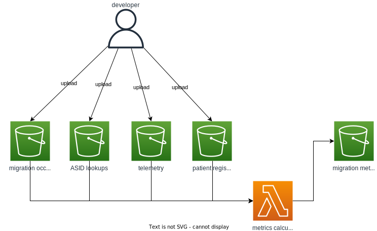

## Package and Deploy

`./scripts/build-and-package.sh`

## Architecture

The metrics calculator is a lambda, written in Python. It takes in data in gzipped CSV format and outputs a JSON file.



### Input data

The input data consists of four different kinds of (gzipped) CSV files:

- details of migrations that have occurred
- mappings from ODS code to ASIDs
- Spine messages sent & received for ASIDs
- GP practice patient registration counts.

#### Migration occurrences data

Details about migrations that have occurred originate in exports taken from the finance system. These Excel spreadsheets contain many worksheets with mostly irrelevant data, so in order to simplify things for the metrics calculator, the data in the "Pending Act upload" (or similar—it's not entirely consistently named) worksheet is copied into a blank spreadsheet from where it can be exported in CSV format. This CSV file is then manually gzipped and uploaded to the migration occurrences S3 bucket.

#### ASID mappings data

A mapping of ODS codes to ASIDs is published once a month by email. Contact the DIR team to request a subscription to the data.

The CSV files are manually gzipped and uploaded to the ASID lookups S3 bucket.

#### Telemetry data

In order to calculate the cutover period for a migration, Spine messages are checked around the time of the migration to see when the old system (referenced by its ASID) stops sending and receiving messages and when the new system starts sending and receiving messages.

A copy of Spine messages exists in Splunk, where queries on the data can be run. The splunk data exporter lambda will query Splunk for message activity during a given time window, export that data to a CSV file, and then upload it to the telemetry S3 bucket.

#### Patient registration counts

Patient registration data can be downloaded from [this website](https://digital.nhs.uk/data-and-information/publications/statistical/patients-registered-at-a-gp-practice) and uploaded to the patient registrations S3 bucket. The metrics calculator will look for the registration count at the practice in the month that the migration occurred, so data for every month containing a migration occurrence will need uploading to the bucket.

## Gzipping CSV files

To gzip a CSV file, run the following command from the command line:

```bash
gzip -c <CSV_FILE_PATH> > <OUTPUT_FILE_PATH>
```

- `CSV_FILE_PATH`: The path to the CSV file to be compressed.
- `OUTPUT_FILE_PATH`: The path to output the gzipped data to.
